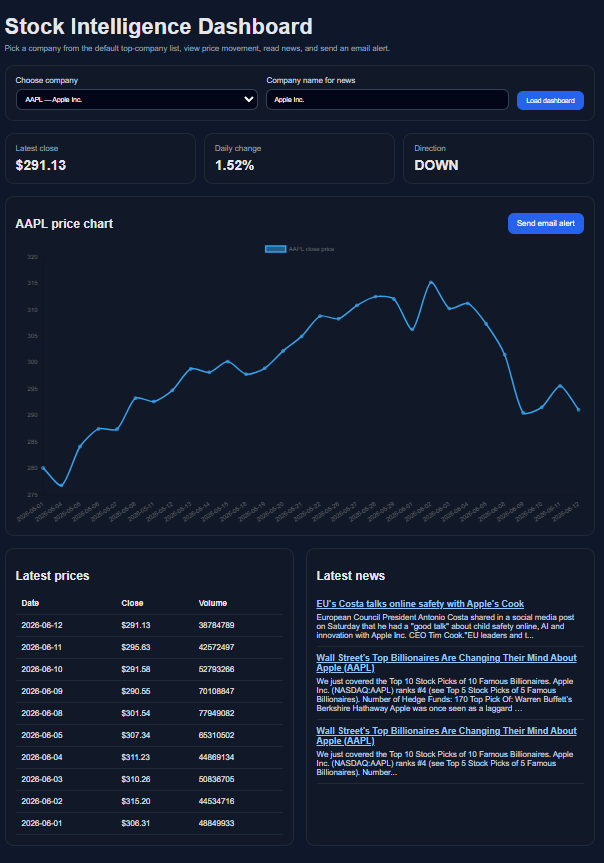

# 📈 StockWise — Django Stock Intelligence Platform

[](https://www.python.org/)
[](https://www.djangoproject.com/)
[](https://www.chartjs.org/)
[](https://www.pythonanywhere.com/)

A production-style stock intelligence web application built with Django. Users can explore stock price movements, read company news, and receive email alerts.

🔗 **Live Demo:** https://austinarshadi.pythonanywhere.com

---

## 📸 Dashboard Preview



---

## ✨ Features

* 📊 Interactive stock charts with Chart.js
* 🏢 Top 100 company dropdown
* 📰 Real-time company news via NewsAPI
* 📧 Email alerts for stock updates
* 📱 Mobile-responsive UI
* 🔐 Environment variable management with `.env`
* ☁️ Live deployment on PythonAnywhere

---

## 🛠 Tech Stack

* **Backend:** Django 5.2
* **Language:** Python 3.13
* **Database:** SQLite
* **Charts:** Chart.js
* **APIs:** Alpha Vantage, NewsAPI
* **Deployment:** PythonAnywhere

---

## 📂 Project Structure

```text
stockwise-django/
├── apps/
│   ├── alerts/
│   │   ├── services/
│   │   │   └── email_alerts.py
│   │   └── ...
│   └── stocks/
│       ├── management/
│       │   └── commands/
│       │       └── seed_companies.py
│       ├── services/
│       │   ├── alpha_vantage.py
│       │   └── news_api.py
│       └── ...
├── config/
├── static/
├── templates/
├── .env.example
├── .gitignore
├── manage.py
└── requirements.txt
```

---

## 🚀 Local Setup

```bash
python -m venv .venv
source .venv/bin/activate      # Linux/macOS

# Windows
.venv\Scripts\activate

pip install -r requirements.txt

cp .env.example .env           # Linux/macOS
copy .env.example .env         # Windows

python manage.py migrate
python manage.py seed_companies
python manage.py runserver
```

Open:

```text
http://127.0.0.1:8000/
```

---

## 🔐 Environment Variables

Create a `.env` file:

```env
SECRET_KEY=your_secret_key
DEBUG=True

ALPHA_VANTAGE_API_KEY=your_key
NEWS_API_KEY=your_key

EMAIL_HOST=smtp.gmail.com
EMAIL_PORT=587
EMAIL_ADDRESS=your_email@gmail.com
EMAIL_PASSWORD=your_app_password
EMAIL_TO=receiver@example.com
```

**Never commit `.env` to GitHub.**

---

## 📱 Mobile Experience


---

## 📧 Email Alerts


---

## 🌐 Deployment

The application is deployed on PythonAnywhere:

**Live URL:** https://austinarshadi.pythonanywhere.com

---

## 🧠 Future Improvements

* User authentication
* Personal watchlists
* Custom stock alerts
* WebSocket real-time updates
* Technical indicators (RSI, MACD, SMA)
* Portfolio tracking
* AI-generated news summaries

---

## 📜 License

This project is open-source and available under the MIT License.
